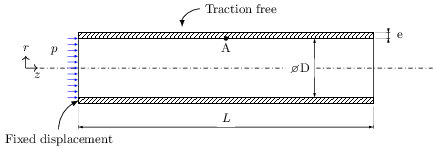
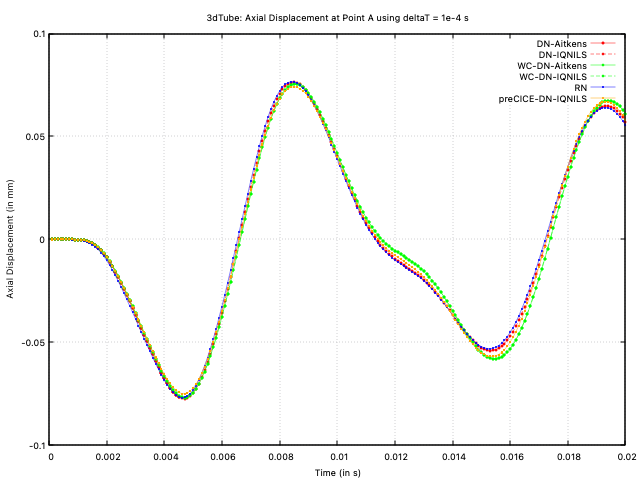
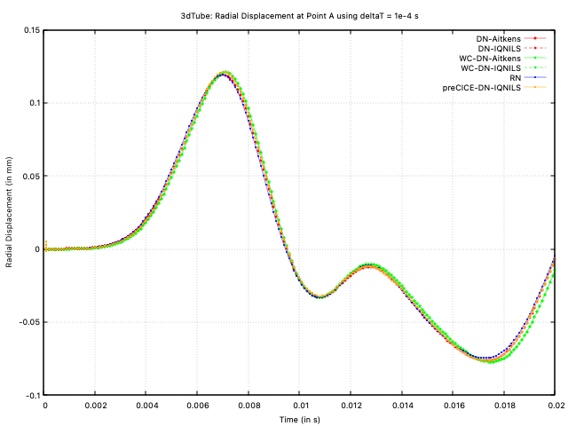
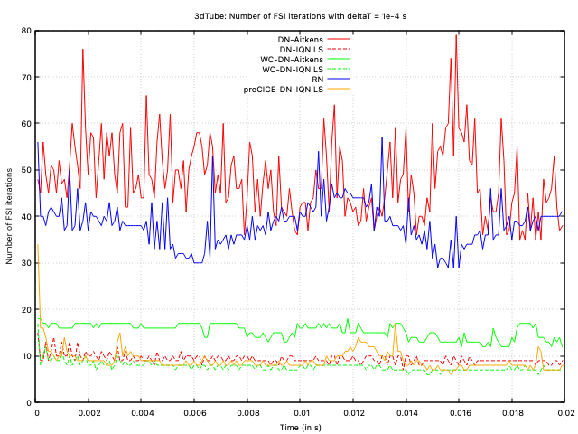
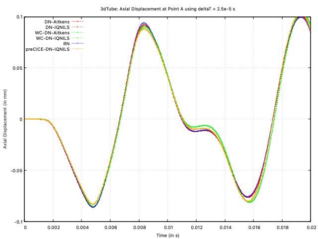
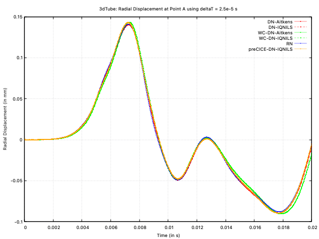
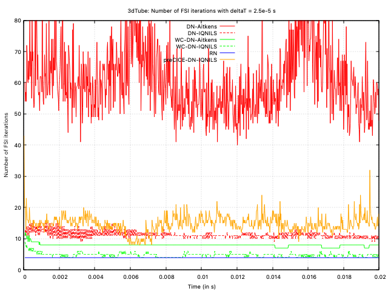

# My fourth tutorial: `3dTube`

---

## Tutorial Aims

- Demonstrate the solution of an internal flow fluid-solid interaction problem;
- Demonstrate the fluid-solid interaction coupling approaches available in solids4foam;
- Provide insight into the relative performance of the different coupling approaches for internal flows;
- Examine the effect of time-step on the performance of the coupling approaches.


## Case Overview

This case consists of a pressure pulse applied in a thick-walled elastic tube (Figure 1).


**Figure 1: Wave propagation in an elastic pipe**

The fluid is assumed incompressible, Newtonian and isothermal, with a density of 1000.0 kg/m3 and kinematic viscosity of 3e-6 m2/s. A pressure wave, with a peak of 1333.3 Pa, is applied at the tube inlet for a duration of 3e-3 s. The outlet pressure is held at 0 Pa throughout.

The tube wall is assumed an isotropic elastic body under the small-strain regime, modelled with Hooke's law, for consistency with the original publication that proposed this benchmark. The density is 1200.0 kg/m3, Young's modulus is 300 kPa, and Poisson's ratio is 0.3.

The case demonstrates a strong coupling between the fluid and the solid due to the high fluid-to-solid density ratio. When using a partitioned solution approach (as in solids4foam), the so-called 'added-mass operator' makes the problem difficult to solve due to numerical instabilities.

Currently, in solids4foam, there are two classes of approaches for partitioned FSI coupling:
    - **Dirichlet-Neumann coupling**, where a Dirichlet condition is applied to the fluid velocity and Neumann conditions to the fluid pressure and solid displacement. This approach **does not** require modification of the underlying fluid solver; see [Tuković Ž, Karač A, Cardiff P, Jasak H, Ivanković A, 2018, OpenFOAM finite volume solver for fluid–solid interaction. Trans FAMENA, 42(3):1–31.10.21278/TOF.42301](https://hrcak.srce.hr/206941);
        - **Robin-Neumann coupling**, where a Dirichlet condition is applied to the fluid velocity, a Robin condition to the fluid pressure, and a Neumann condition to the solid displacement. This approach **does** require modification of the underlying fluid solver, and hence it cannot be considered a *black-box* coupling approach; see [Tuković Ž, Bukač M, Cardiff P, Jasak H, Ivanković A, 2018, Added mass partitioned fluid–structure interaction solver based on a robin boundary condition for pressure. In: OpenFOAM selected papers of the 11th workshop. Springer, Berlin, pp 1–23](https://www.springerprofessional.de/en/added-mass-partitioned-fluid-structure-interaction-solver-based-/16418780).

For each of these two classes of approach, we can employ different methods to accelerate the FSI iteration loop convergence; within solids4foam, we can use:
    - Aitken's dynamic relaxation;
    - the IQN-ILS algorithm of [Joris Degroote, Robby Haelterman, Sebastiaan Annerel, Peter Bruggeman, Jan Vierendeels, Performance of partitioned procedures in fluid–structure interaction, Computers & Structures, 88, 7–8, 2010, 10.1016/j.compstruc.2009.12.006](https://www.sciencedirect.com/science/article/abs/pii/S0045794909003022).

As well as using these acceleration algorithms, we can also use a weakly compressible fluid model rather than the standard fully incompressible model; for FSI, weakly compressible fluid models how been shown to improve convergence, for example, see [E. Tandis and A. Ashrafizadeh, “A numerical study on the fluid compressibility effects in strongly coupled fluid–solid interaction problems,” Engineering with Computers, 2019, doi: 10.1007/s00366-019-00880-4.](https://doi.org/10.1007/s00366-019-00880-4).

In this tutorial, we will compare six variants of the approaches above:

1. **Dirichlet-Neumann formulation with Aitken's acceleration and an incompressible fluid model**: We use the `pimpleFluid` fluid model.
2. **Dirichlet-Neumann formulation with IQNILS acceleration and an incompressible fluid model**: We use the `pimpleFluid` fluid model.
3. **Dirichlet-Neumann formulation with Aitken's acceleration and a weakly compressible fluid model**: We use the `sonicLiquidFluid` fluid model.
4. **Dirichlet-Neumann formulation with IQNILS acceleration and a weakly compressible fluid model**: We use the `sonicLiquidFluid` fluid model.
5. **Robin-Neumann formulation with an incompressible fluid**: Support for this approach is implemented in the `pimpleFluid` model, where we apply special interface boundary conditions: `elasticWallPressure` for the fluid pressure field; and `elasticWallVelocity` for the fluid velocity field. 
6. **Dirichlet-Neumann formulation with Aitken's acceleration and an incompressible fluid model using preCICE**: This approach is the same as approach 1, except the [preCICE](http://precice.org) coupling implementation is used. preCICE is an open-source coupling library for partitioned multi-physics simulations. In this case, `solids4Foam` is used as the solid solver, and standard `pimpleFoam` is used as the fluid solver (as opposed to solids4foam's `pimpleFluid` fluid model). Due to implementation differences, this preCICE IQNILS approach may perform differently than the built-in solids4foam approach.

In all approaches, the solid domain setup is exactly the same, where an incremental small strain formulation is used (the `linearGeometry` solid model). One-quarter of the tube's cross-section is considered, although the case could actually be modelled as 2-D axisymmetric. The test is run for 0.02 s. A relatively tight FSI loop tolerance of 1e-6 is used for all approaches based on the interface motion. For approach 6 (preCICE), the relative displacement tolerance was set to 1e-6, and the relative force tolerance was set to 1e-3.

---

## Running the Case

For approaches 1 to 4, the tutorial case is located at `solids4foam/tutorials/fluidSolidInteraction/3dTube`. The case can be run using the included `Allrun` scripts: `Allrun.pimpleFluid` for approaches 1 and 2, i.e.`./Allrun.pimpleFluid`, and `./Allrun.sonicLiquidFluid` for approaches 3 and 4. These scripts update the case with links to the correct files to be used by each approach. The acceleration algorithm, Aitken's or IQNILS, is specified in the `constant/fsiProperties` file. 

For approach 5 (Robin-Neumann formulation), you should change the boundary conditions in the `0/fluid/p` and `0/fluid/U` files to the `elastic*` versions; currently, the Robin approach is only available in foam-extend-4.1.

The tutorial case for approach 6, which uses preCICE, is located at `solids4foam/tutorials/fluidSolidInteraction-preCICE/3dTube`; once again, the `Allrun` script runs the case.

```tip
Remember that a tutorial case can be cleaned and reset using the included `Allrun` script, i.e. `./Allclean`.
```

---

## Expected Results

This case has been proposed as a benchmark for FSI problems. The solution for point A's (see Figure 1) axial and radial displacement is available in: [A. Lozovskiy, M. A. Olshanskii, and Y. V. Vassilevski, “Analysis and assessment of a monolithic FSI finite element method,” Computers and Fluids, vol. 179, pp. 277–288, 2019, doi: 10.1016/j.compfluid.2018.11.004.](https://doi.org/10.1016/j.compfluid.2018.11.004)

### Large Time Step

Initially, we compare the solutions using a relatively large time step size of 1e-4 s. Figure 2 shows the radial displacement at point A vs time, Figure 3 shows the axial displacement at point A vs time, and Figure 4 shows the iterations per time step. In the figures, the approaches are designated as: 

- DNF-Aitken: Dirichlet-Neumann formulation with Aitken's acceleration and an incompressible fluid model;
- DNF-IQNILS: Dirichlet-Neumann formulation with IQNILS acceleration and an incompressible fluid model;
- WC-DNF-Aitken: Dirichlet-Neumann formulation with Aitken's acceleration and a weakly compressible fluid model;
- WC-DNF-IQNILS: Dirichlet-Neumann formulation with IQNILS acceleration and a weakly compressible fluid model;
- RNF: Robin-Neumann formulation with an incompressible fluid;
- preCICE-DN-IQNILS: Dirichlet-Neumann formulation with Aitken's acceleration and an incompressible fluid model using preCICE.


**Figure 2: Axial displacement at point A vs time with deltaT = 1e-4 s**


**Figure 3: Radial displacement at point A vs time with deltaT = 1e-4 s**


**Figure 4: Number of FSI iterations per time-step with deltaT = 1e-4 s**

The predictions from all approaches agree closely. Examining the number of FSI iterations per time step, both implementations (solids4foam and preCICE) of Dirichlet-Neumann coupling with IQN-ILS acceleration are seen to require the least number of iterations. The weakly compressible approach is the next best performing approach, while the incompressible Aitken's-accelerated Dirichlet-Neumann and Robin-Neumann approaches are seen to perform the poorest.

### Small Time Step

To observe the effect of the time step size, the cases were re-run with a smaller time step of 2.5e-5 s, where Figures 5, 6 and 7 show the radial displacement, axial displacement and the number of iterations.

**Figure 5: Axial displacement at point A vs time with deltaT = 2.5e-5 s**


**Figure 6: Radial displacement at point A vs time with deltaT = 2.5e-5 s**


**Figure 7: Number of FSI iterations per time-step with deltaT = 2.5e-5 s**

Unlike the larger time step, the Robin-Neumann approach now requires the least number of iterations per time step (exactly 4 for every time step). The weakly compressible approaches are the next best, where the IQNILS-accelerated compressible model outperforms the Aitken's-accelerated compressible model. The incompressible IQNILS approaches are the next best (both solids4foam and preCICE). Finally, in this case, the Aitken's-accelerated incompressible model shows the poorest performance, requiring an order of magnitude greater number of iterations than the best approach. The impressive performance of the Robin-Neumann approach can also be observed for smaller time steps; in general, for cases like this, if the time step is sufficiently small, the Robin-Neumann approach requires minimal iterations; however, once the time step is large, then the Robin approach diverges or becomes uncompetitive.
