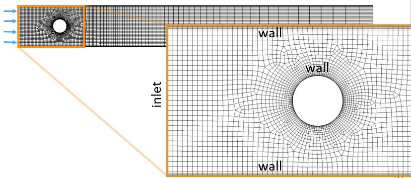
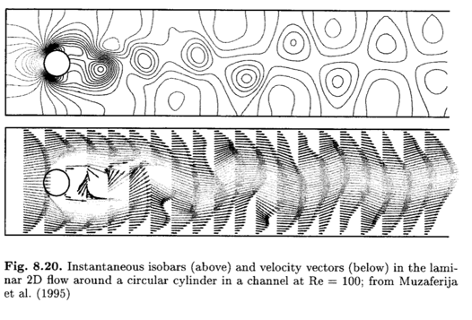
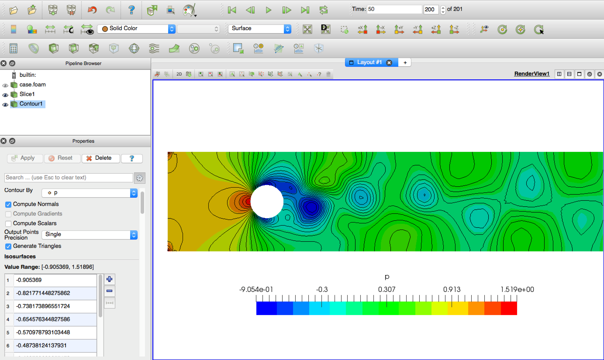

# My second tutorial: `cylinderInChannel`

You can find the files for this tutorial under
[`tutorials/fluids/cylinderInChannel`](https://github.com/solids4foam/solids4foam/tree/master/tutorials/fluids/cylinderInChannel).

---

## Tutorial Aims

- Demonstrate how to perform a fluid-only analysis in solids4foam;
- Explain how a solids4foam fluid case differs from a standard OpenFOAM fluid
  case.

## Case Overview



This is the classic “flow over a cylinder in a channel” test case, as analysed
by, for example, Ferziger and Peric (2002). The problem is modelled as 2-D. The
inlet flow velocity profile is specified (coming in from the left), and the
outlet (right) gauge pressure is zero. The upper wall, lower wall and cylinder
are no-slip walls.

We assume an incompressible Newtonian isothermal laminar fluid, where the
Navier-Stokes governing equations take the form:

$$
\nabla \cdot \boldsymbol{v} = 0 \\
\frac{\partial \boldsymbol{v}}{\partial t}
+ \nabla \cdot (\boldsymbol{v}\boldsymbol{v})
= \nu \nabla^2 \boldsymbol{v}
- \frac{1}{\rho} \nabla p
+ \boldsymbol{f_b}
$$

We will use the PIMPLE pressure-velocity coupling algorithm:

```pseudocode
for all time-steps
    do
        solve momentum equation for U (terms depending on p are calculated explicitly)
        solve pressure equation for p (terms depending on U are calculated explicitly)
    while not converged
end
```

---

## Expected Results

For Re = 100, the flow is expected to be unsteady, with vortices shedding from
the cylinder.



**Pressure contours (top) and velocity vectors (bottom) from Ferziger and
Peric (2002)**

---

## Running the Case

The tutorial case can be run using the included `Allrun` script, i.e.
`> ./Allrun`. In this case, the `Allrun` script is

```bash
#!/bin/bash

# Source tutorial clean functions
. $WM_PROJECT_DIR/bin/tools/RunFunctions

# Source solids4Foam scripts
source solids4FoamScripts.sh

# Check case version is correct
solids4Foam::convertCaseFormat .

# Create the mesh
solids4Foam::runApplication fluentMeshToFoam cylinderInChannel.msh
solids4Foam::runApplication changeDictionary

# Run the solver
solids4Foam::runApplication solids4Foam

# Create plots
if command -v gnuplot &> /dev/null
then
    if [[ -f "./postProcessing/forces/0/forces.dat" ]]
    then
        echo "Generating force.pdf using gnuplot"
        gnuplot force.of9.gnuplot &> /dev/null
    else
        echo "Generating force.pdf using gnuplot"
        gnuplot force.gnuplot &> /dev/null
    fi
else
    echo "Please install gnuplot if you would like to generate the plots"
fi
```

where the `solids4Foam::convertCaseFormat .` script makes minor changes to the
case to make it compatible with your version of OpenFOAM/foam-extend. As can be
seen, the mesh in the fluent format is converted to the OpenFOAM format before
running the `solids4Foam` solver. After the solver has finished, a `force.pdf`
plot is generated if the `gnuplot` program is installed.

```tip
Remember that a tutorial case can be cleaned and reset using the included
`Allrun` script, i.e. `> ./Allclean`.
```

---

## Analysing the Results

In the ParaView, a [von Kármán vortex street](https://en.wikipedia.org/wiki/Kármán_vortex_street)
is clearly visible by viewing the pressure field `p`:


**Pressure field**

---

## Delving Deeper

---

If you would like to learn more about the case, then please continue; if not,
how about you check out another tutorial.

---

### Case Structure

The case follows the typical `pimpleFoam` (or `pimpleDyMFoam`) case structure:

```plaintext
cylinderInChannel
├── 0
│   ├── U
│   └── p
├── Allclean
├── Allrun
├── constant
│   ├── RASProperties
│   ├── dynamicMeshDict
│   ├── fluidProperties
│   ├── physicsProperties
│   ├── polyMesh
│   │   └── …
│   ├── transportProperties
│   └── turbulenceProperties
├── cylinderInChannel.msh
└── system
    ├── changeDictionaryDict
    ├── controlDict
    ├── fvSchemes
    └── fvSolution
```

The only difference with a `pimpleFoam` case is that a
`constant/physicsProperties` dictionary must be present, where the type of
analysis is specified:

```c++
type     fluid;
//type   solid;
//type   fluidSolidInteraction;
```

In addition, as this is a "fluid" analysis, a `constant/fluidProperties`
dictionary must also be present, where the PIMPLE algorithm for an
incompressible isothermal fluid is specified:

```c++
fluidModel pimpleFluid;

pimpleFluidCoeffs
{}
```

```note
The `pimpleFluid` fluid model does not require any settings to be specified.
Parameters related to the PIMPLE algorithm as instead specified in
`system/fvSolution`, just like for the `pimpleFoam` solver.
```

Apart from specifying the `physicsProperties` and `fluidProperties`
dictionaries, the case is equivalent to a standard `pimpleFOAM` case, e.g. in
terms of `transportProperties`, `RASProperties`, `dynamicMeshDict`, `U`, `p`,
`fvSchemes`, etc.

---

### Code: `fluidModel`

For the `cylinderInChannel` test case, we have selected a “fluid” analysis in
the `physicsProperties` dictionary: this means a `fluidModel` class will be
selected; then, we specify the actual `solidModel` class to be the `pimpleFluid`
class.

The code for the pimpleFluid class is located at:

```bash
solids4foam/src/solids4FoamModels/fluidModels/pimpleFluid/pimpleFluid.C
```

and this code directly ports the `pimpleFoam` solver code; in particular, see
the `evolve()` function with `pimpleFluid.C`.
