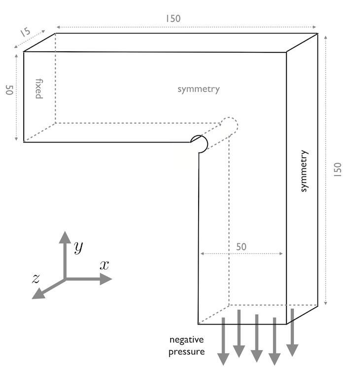
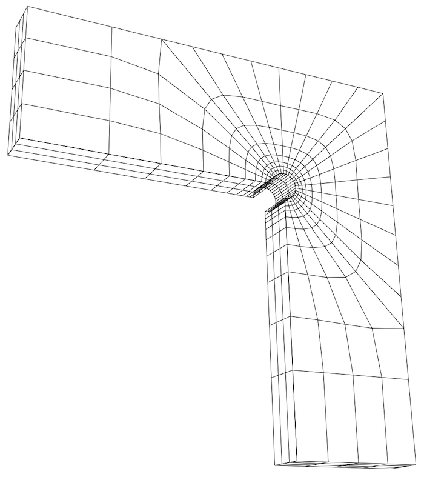
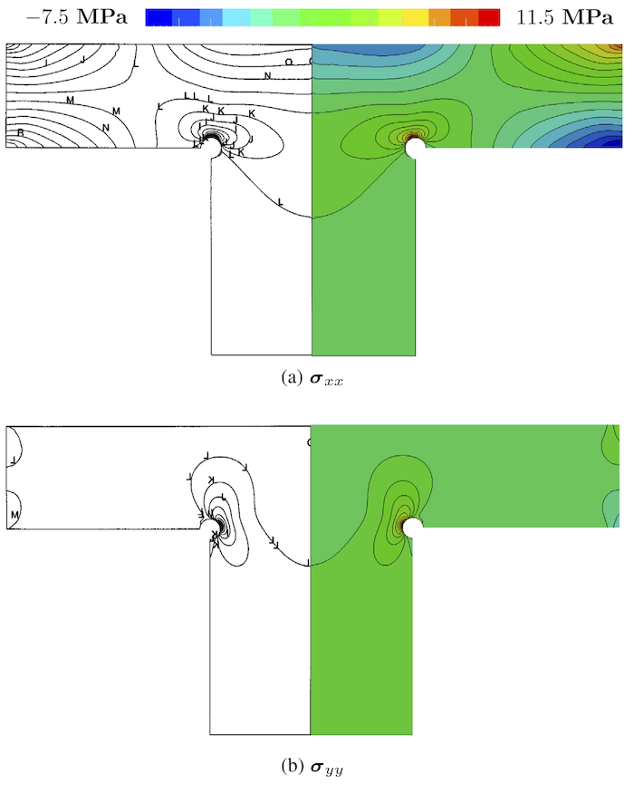

# Tutorial: `narrowTmember`

Prepared by Philip Cardiff

---

## Tutorial Aims

- Demonstrate how to perform a linear-static stress analysis of a 3-D
  engineering component in solids4foam;
- Compares the performance of two finite volume solid models: (i) the coupled
  cell-centred `coupledUnsLinearGeometryLinearElastic` model, and (ii) the
  segregated cell-centred `linearGeometryTotalDisplacement` model.
- Shows how to modify a case, which uses the
  `coupledUnsLinearGeometryLinearElastic` solid model, to use the
  `linearGeometryTotalDisplacement` solid model.

## Case Overview

This case comprises a narrow engineering component with a T cross-section
(Figure 1). This case was proposed as a benchmark by
[Demirdzic et al., 1997, Benchmark solutions of some structural analysis problems using the finite-volume method and multigrid acceleration. Int J Numer Methods Eng.](<http://refhub.elsevier.com/S0045-7949(16)30604-6/h0015>)
Due to symmetry, the solution domain consists of one-quarter of the component. A
constant negative pressure of 1 MPa is applied to the lower surface, and the
upper left surface is fully clamped (Figure 1). The Young’s modulus is 210 GPa,
and Poisson’s ratio is 0.3. A radius $$R = 5$$ mm hole is located at the
expected stress concentration. Four separate systematically refined hexahedral
meshes (624, 4992, 39 936, and 319 488 cells) are examined here, mimicking the
meshes employed by Demirdzic et al.; the coarsest mesh is shown in Figure 2.



**Figure 1: Geometry and loading with dimensions in mm.**



**Figure 2: Coarest hexahedral mesh (624 cells)**

---

## Running the Case

The tutorial case is located at
`solids4foam/tutorials/solids/linearElasticity/narrowTmember`. The case can be
run using the included `Allrun` script, i.e. `./Allrun`. In this case, the
Allrun simply consists of creating the mesh using blockMesh (`./blockMesh`)
followed by running the solids4foam solver (`./solids4Foam`).

```warning
The coupled version of this case, which uses the `coupledUnsLinearGeometryLinearElastic`, can currently only be run using solids4foam built on foam-extend.
```

To modify the case to run with the segregated `linearGeometryTotalDisplacement`
solid model, the following changes are required:

- In `0/D`
  - Replace `blockSolidTraction` with `solidTraction`
  - Replace `blockFixedDisplacement` with `fixedDisplacement`
  - Replace `blockFixedDisplacementZeroShear` with `fixedDisplacementZeroShear`
- In `constant/solidProperties`
  - Replace `solidModel       coupledUnsLinearGeometryLinearElastic;` with
    `solidModel     linearGeometryTotalDisplacement;`
  - (This is already present in the tutorial case) Add the following dictionary
    `linearGeometryTotalDisplacementCoeffs {}`
- In `system/fvSchemes`
  - Set the default `gradSchemes` to `pointCellsLeastSquares` for
    OpenFOAM.com/OpenFOAM.org, or `leastSquares` for foam-extend
  - Set the default `divSchemes` to `Gauss linear`
  - Set the default `laplacianSchemes` to `Gauss linear skewCorrected 1`
  - Set the default `interpolationSchemes` to `linear`

The case can the be run as before, i.e. `> blockMesh && solids4Foam`.

---

## Expected Results

Figure 3 shows the $$\sigma_{xx}$$ and $$\sigma_yy$$ stress distributions on the
plane z = 0 m (symmetry plane) for the finest mesh. The predictions agree
closely with the results of Demirdzic et al. Further comparisons can be found in
[Cardiff et al., 2016, A block-coupled Finite Volume methodology for linear elasticity and unstructured meshes, Comp. and Struct.](https://www.sciencedirect.com/science/article/pii/S0045794916306046)



**Figure 3: Predicted stress component distributions on the plane z = 0:0 m
(right) compared with results from Demirdzic et al. (left).**

The wall-clock times and memory requirements for each run are given in Table 1,
where the results for the coupled and segregated solid models are compared. The
coupled solver used a bi-conjugate gradient stabilised linear solver with ILU(0)
preconditioner, while the segregated solver used a conjugate gradient linear
solver with ILU(0) preconditioner. Both approaches used a solution tolerance of
$$1 \times 10^{-6}$$. In this case, the coupled solver is approximately four
times faster than the segregated solver but requires about four times more
memory.

```note
The wall-clock times given in Table 1 were recorded in 2015 using one core of a 2.4 GHz Intel Ivy Bridge CPU. Better performance can be expected using a new machine.
```

**Table 1: Wall-clock time (in s) and maximum memory usage (in MB).**

| Mesh    | Coupled  |            | Segregated |            |
| ------- | -------- | ---------- | ---------- | ---------- |
|         | **Time** | **Memory** | **Time**   | **Memory** |
| 624     | 0.2      | 15         | 0.7        | 8          |
| 4 992   | 2        | 58         | 6          | 24         |
| 39 936  | 29       | 340        | 98         | 88         |
| 319 488 | 421      | 2 400      | 2 220      | 560        |

```warning
The `coupledUnsLinearGeometryLinearElastic` solid model currently does not run in parallel. For a coupled solid model that *does* run in parallel, use the `vertexCentredLinGeomSolid` solid model.
```
