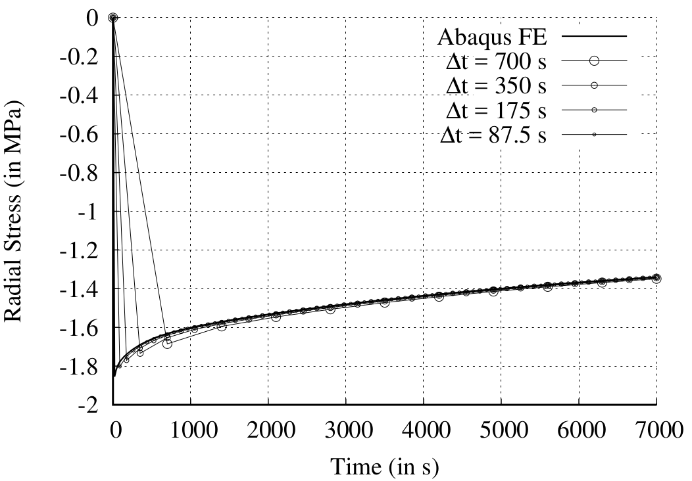

# Stress relaxation of a viscoelastic tube: `viscoTube`

---

Prepared by Philip Cardiff and Ivan Batistić

---

## Tutorial Aims

- Demonstrate a transient viscoelastic analysis;
- Compare viscoelastic predictions with a reference finite element solution.

---

## Case Overview

This case consists of a tube constructed from a viscoelastic material [1], where
the inner surface is quickly displaced in the radial direction; subsequently,
the tube relaxes towards a steady state after initially experiencing high wall
stresses. The case is modelled as 2-D with quarter symmetries, as schematically
shown in Figure 1. The cylindrical tube has an inner radius of $$5$$ mm and an
outer radius of $$10$$ mm. The tube material is assumed to be a viscoelastic
polymer where a Prony series represents its deviatoric response, and its
bulk/volumetric response is assumed to be elastic. The mechanical parameters for
the Prony series Maxwell models are given in Table 1.

### Table 1: Viscoelastic mechanical properties given in terms of a Prony series

|    Material parameter     |     Symbol     |     Value     |
| :-----------------------: | :------------: | :-----------: |
|     Young’s modulus 1     |    $$E_1$$     | $$2.93$$ GPa  |
|     Young’s modulus 2     |    $$E_2$$     | $$5.86$$ GPa  |
|     Young’s modulus 3     |    $$E_3$$     | $$6.60$$ GPa  |
|     Young’s modulus 4     |    $$E_4$$     | $$18.32$$ GPa |
|     Relaxation time 1     |   $$\tau_1$$   |   $$30$$ s    |
|     Relaxation time 2     |   $$\tau_2$$   |   $$300$$ s   |
|     Relaxation time 3     |   $$\tau_3$$   |  $$3000$$ s   |
|     Relaxation time 4     |   $$\tau_4$$   |  $$12000$$ s  |
|                           |                |               |
| _Relaxed_ Young’s modulus | $$E_{\infty}$$ | $$39.58$$ GPa |
|      Poisson's ratio      |    $$\nu$$     |   $$0.33$$    |

The inner surface of the tube is displaced $$1$$ µm in the radial direction. To
mimic the displacement occurring instantaneously, it is applied within the first
time step. The outer surface of the tube is traction-free. The case is solved
over a period of $$7000$$ s with a time step of $$800$$ s. Inertia and gravity
terms are neglected, and the problem is solved as a plane strain. The cylinder
is discretised with $$1,152$$ cells: $$24$$ cells in the radial direction and
$$48$$ cells in the circumferential direction.

![Figure 1: Problem geometry [1]](./images/viscoTube-geometry.png)
**Figure 1: Problem geometry [1]**

---

## Expected Results

In Cardiff et al. [[1]](https://arxiv.org/abs/1808.10736), the predicted radial
stress and radial displacement on the inner tube surface are compared with
results from commercial finite element software Abaqus. To illustrate the effect
of loading increment size on the employed material law integration, four
separate time step sizes are examined ($$700$$, $$350$$, $$175$$, and $$87.5$$
s). From Figure 2, one can see that the predicted stresses and displacements are
relatively insensitive to time-step size. As the step size is reduced, the
predictions are seen to approach the reference finite element solution ("Abaqus
FE").


![Radial displacement]./images/viscoTube-radialDisplacement.png)
**Figure 2: Radial stress and radial displacement predictions across the wall
thickness, showing the effect of loading step size [1]. Comparison is given with
finite element results from Abaqus ("Abaqus FE")**

The above plots can be easily reproduced using post-processing function objects
added to `controlDict`. For the chosen point in the domain, the
`solidPointStress` function object is used to write the corresponding stress
tensor and the `solidPointDisplacement` fuction object to write displacement
values.

```c++
functions
{
    pointStressSymmy
    {
        type    solidPointStress;
        point   (0.0075 0 0);
    }
    pointStressSymmx
    {
        type    solidPointStress;
        point   (0 0.0075 0);
    }
    pointDisp
    {
        type    solidPointDisplacement;
        point   (0.0075 0 0);
    }
}
```

---

## Running the Case

The tutorial case is located at
`solids4foam/tutorials/solids/viscoelasticity/viscoTube`. The case can be run
using the included `Allrun` script, i.e. `> ./Allrun`. In this case, the
`Allrun` creates the mesh using `blockMesh` (`> blockMesh`) followed by
`solids4Foam` solver (`> solids4Foam`).

---

### References

[1]
[P. Cardiff, A. Karač, P. De Jaeger, H. Jasak, J. Nagy, A. Ivanković, and Ž. Tuković, “An open-source finite volume toolbox for solid mechanics and fluid-solid interaction simulations,” arXiv preprint arXiv:1808.10736, 2018.](https://arxiv.org/abs/1808.10736)
