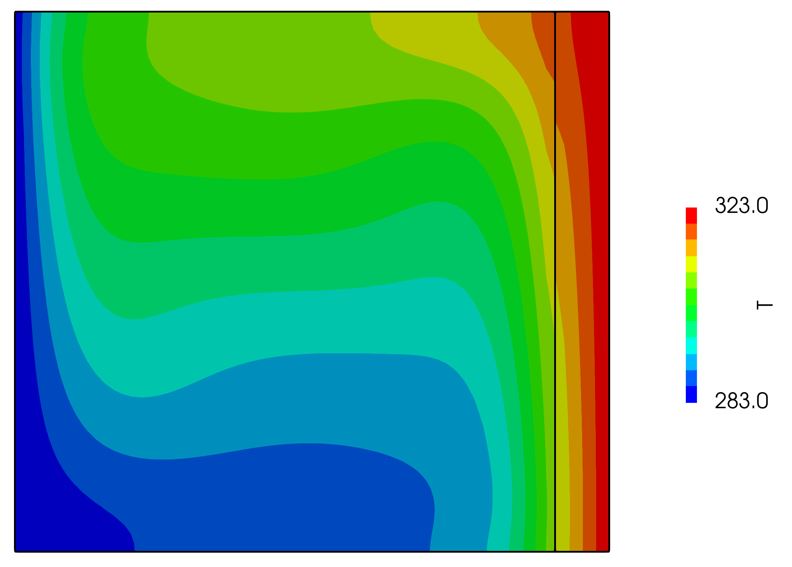

# Lid-driven cavity flow with a hot wall: `thermalCavity`

---

Prepared by Željko Tuković and Philip Cardiff

---

## Tutorial Aims

- Demonstrates how to perform a thermal conjugate heat transfer analysis.

---

## Case Overview

This case extends the traditional OpenFOAM `cavity` tutorial to include a
coupled thermal analysis. The right wall of the cavity is assumed to be elastic
and initially hotter than the cavity fluid (Figure 1). A coupled thermo
interaction (conjugate heat transfer) analysis is performed where the heat
equation is solved in the fluid and solid regions in addition to the
Navier-Stokes equations in the fluid. The deformation is not calculated in the
solid (for a thermo-fluid-solid interaction tutorial, see the
[hotTJunction](https://www.solids4foam.com/tutorials/more-tutorials/thermo-fluid-solid-interaction/hotTJunction.html)
case). The coupling procedure enforces temperature and heat flux continuity at
the fluid-solid interface. The right boundary of the solid is heated, causing
the solid's temperature to increase, transferring heat to the fluid domain.
Within the fluid, the temperature differences generate forces that drive fluid
flow.

At time $$t = 0$$, the fluid temperature is $$283$$ K, whereas the solid
temperature is $$323$$ K. The fluid domain's top left, and bottom boundaries are
assumed to be stationary no-slip walls. The left of the fluid boundary is held
at a fixed temperature of $$283$$ K, while the right of the solid is held at
$$323$$ K. All other external boundaries are assumed to be adiabatic (zero heat
flux). The right of the fluid domain and the left of the solid domain represent
the fluid-solid thermal interface, where thermal constraints (temperature and
heat flux continuity) are enforced. In the fluid domain, gravity is assumed to
act in the negative vertical direction $$(0\;$$-$$9.81\; 0)$$ m/s$$^{2}$$ and
thermal inertial effects are included. The end time is $$10$$ s and time-step
size $$\Delta t = 0.01$$ s.

**Figure 1: Problem geometry and initial conditions**

The assumed fluid and solid physical parameters are given in Table 1.

**Table 1: Physical Parameters**

|          Parameter           |       Symbol       |          Value           |
| :--------------------------: | :----------------: | :----------------------: |
|        Solid Density         |     $$ \rho$$      |       1 kg m$$^{-3}$$    |
| Solid Coefficient of Thermal |   $$ \alpha$$ | $$1\times10^{-5}$$ K$$^{-1}$$ |
|        Expansion             |                    |                          |
|   Solid Thermal Conductivity |       $$k$$        |    $$0.04$$ W/(m K)      |
| Solid Specific Heat Capacity |      $$C_p$$       |   $$1010$$ J/(kg K)      |
|       Fluid Viscosity        |      $$\mu$$       |      0.001 Pa s          |
|        Fluid Density         |      $$\rho$$      |       1 kg m$$^{-3}$$    |
| Fluid Coefficient of Thermal | $$ \beta$$ | $$2.85\times10^{-3}$$ K$$^{-1}$$ |
|        Expansion             |                    |                          |
|   Fluid Thermal Conductivity |    $$\lambda$$     |    $$0.03$$ W/(m K)      |
| Fluid Specific Heat Capacity |      $$ C_p$$      |   $$1010$$ J/(kg K)      |
| Fluid Reference Temperature  |    $$T_{ref}$$     |       $$303$$ K          |
| Fluid Turbulent Prandtl No.  | $$ \text{Pr}_t $$  |          0.85            |
| Gravity        |       $$g$$        | $$(0 \; $$-$$9.81 \; 0)$$ m $$s^{-2}$$ |

## Results

Over the duration of the simulation, the solid heats the fluid, causing a
thermal circulation to form in the fluid. The evolution of the temperature of
velocity fields is shown in Video 1. The temperature distribution at $$t = 10$$
s is shown in Figure 2.

**Figure 2: Temperature distribution at the end time**


**Video 1: Evolution of the temperature and velocity distributions within the
fluid and solid domains**

---

## Running the Case

The tutorial case is located at
`solids4foam/tutorials/thermofluidSolidInteraction/thermalCavity`. The case can
be run using the included `Allrun` script, i.e. `> ./Allrun`. The `Allrun`
script first executes `blockMesh` for both `solid` and `fluid` domains
(`> blockMesh -region fluid` and `> blockMesh -region solid` ), and the
`solids4foam` solver is used to run the case (`> solids4Foam`).
